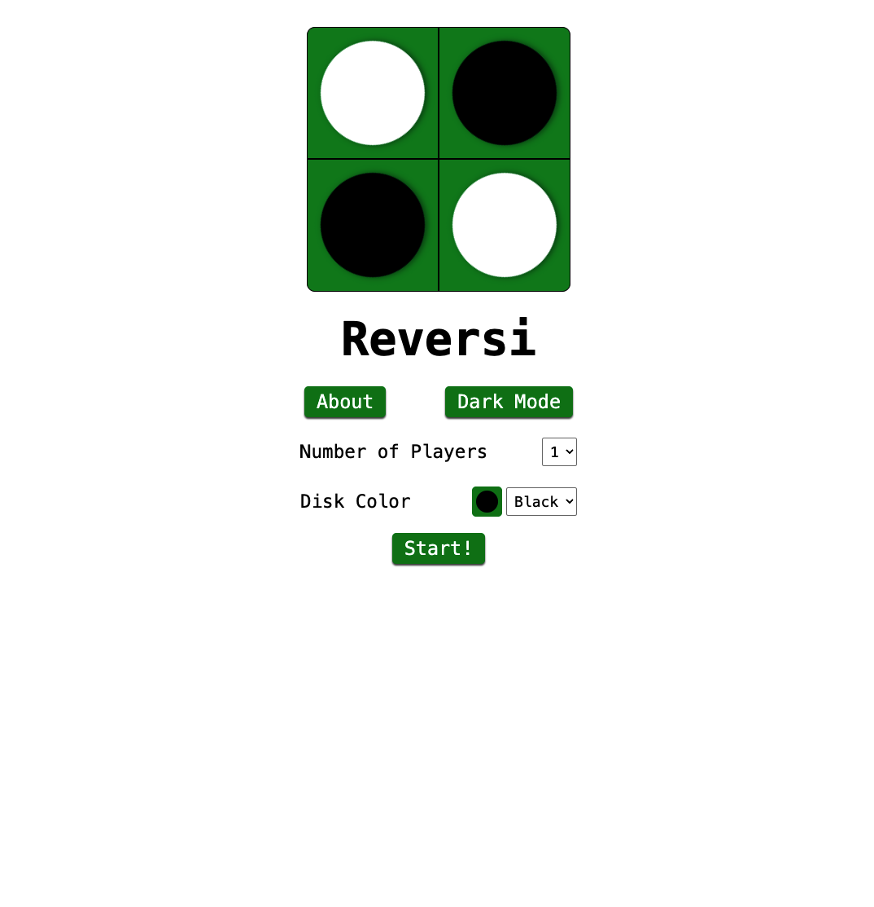
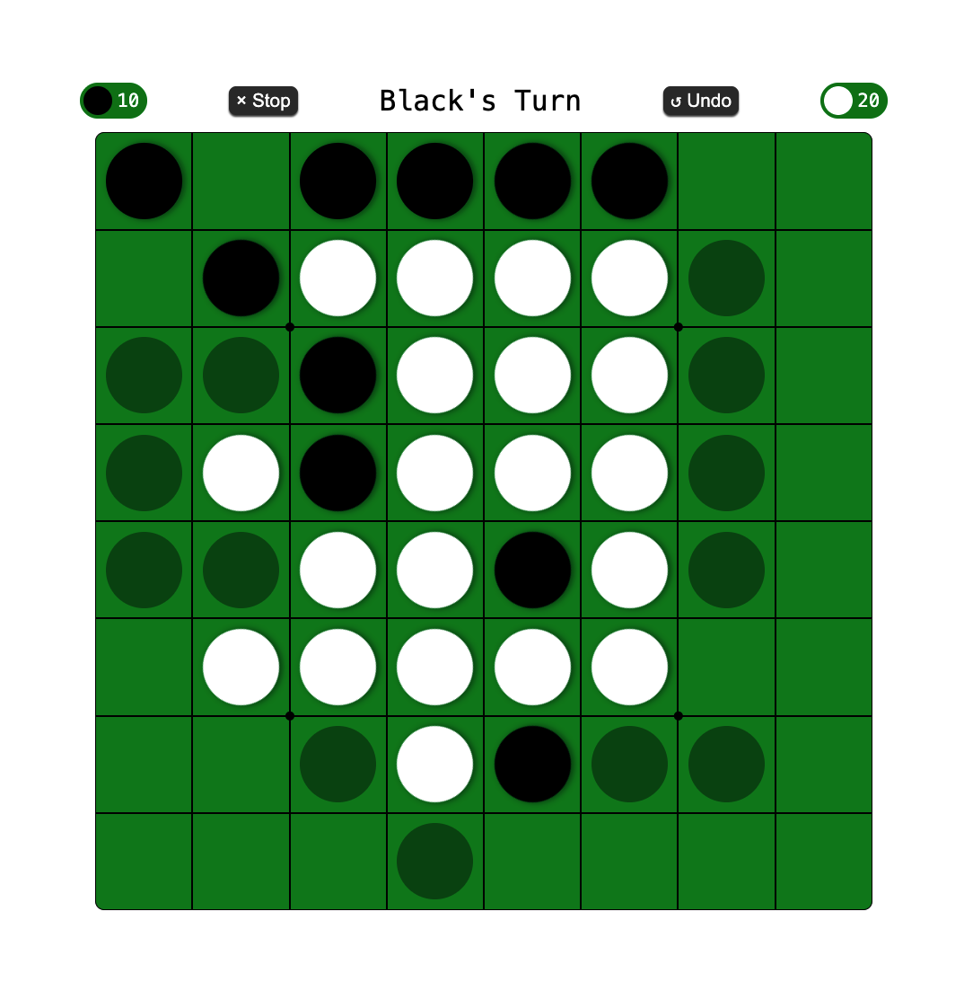
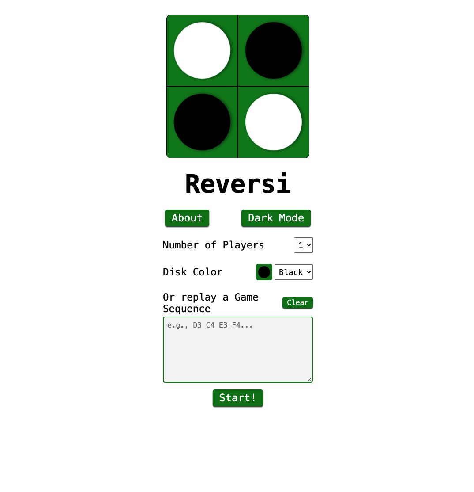
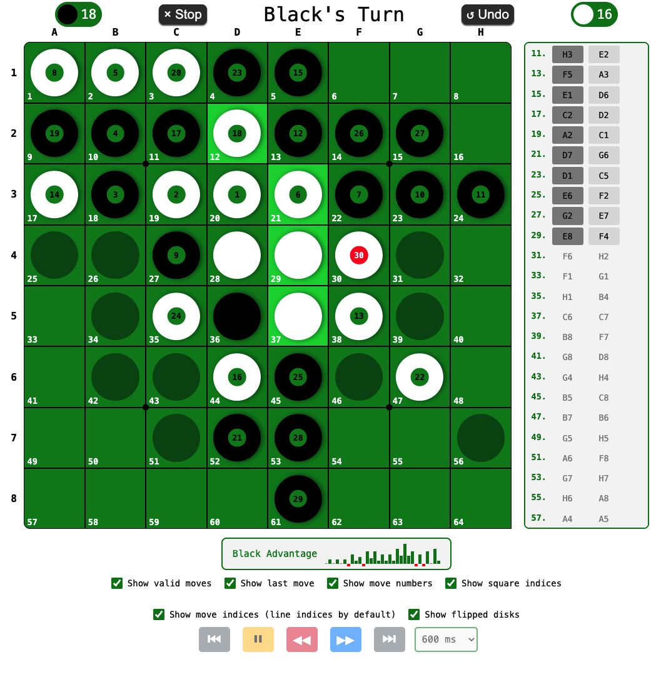

# Reversi

This project is a fork of https://github.com/lazy-guy/reversi.

## [FR] Evolutions
Ce projet répond à deux motivations : 
1. le besoin de disposer d'un outil permettant de visualiser des parties (série de coups ou juste un état) et d'intergir avec, dans le cadre d'un travail de reproduction de recherches concernant `Othello-GPT`;
2. l'expérimentation de l'emploi d'assistants IA de codage, avec une importance accordée aux tests.

Par rapport au [projet initial](https://github.com/lazy-guy/reversi) sélectionné pour la simplicité de sa structure, de son code et du design de son interface graphique, j'ai ajouté les fonctionnalités suivantes :
- saisie d'une série de coups dans le format de type "PGN" ("A1 B2") qui sont alors rejoués, permettant d'afficher les différents états de la partie. Il est possible de continuer la partie selon le mode de jeu;
- saisie d'un état de partie au format "FEN" adaptée au reversi ("...xx.ox.oo..."): une chaîne de 64 caractères parmi `x`: blanc, `o`: noir, `.`: vide, avec un optionnel 65ème indiquant quel joueur à le trait s'il s'agit de l'état d'une partie en cours;
- l'affichage d'informations concernant le plateau et la partie : coordonnées "A1 B2" et indice des cases, numéro du coup correspond au pion posé, indication du dernier coup, les pions retournés, et l'historique des coups joués, l'évolution de l'avantage du premier joueur (joueur "noir");
- ajout du mode de jeu "ordinateur" contre ordinateur.

99,9% du code des nouvelles fonctionnalités a été produit avec GitBub Copilot (différents modèles utilisés à travers le mode "Auto") et Claude Code (différents modèles utilisés selon la date d'utilisation), à partir de demandes formulées plus ou moins précisemment du point de vue technique. Le retour d'expérience sera le sujet d'un post de blog à venir.

## [EN] Updates
This project is the result of two motivations:
- the need of a tool that allows visualisation of games (moves sequences or only a game state) and to interact with, in the frame of a work of search paper results reproductions about `Othello-GPT`;
- to experiment the use of AI coding assistant, with a focus on testing.

Compared with the [initial project](https://github.com/lazy-guy/reversi) which was selected because of the simplicity of its structure, of the code and its UI design, I added les followings features:
- input a sequence of moves in the 'PGN' format ('A1 B2'), which are then replayed, allowing the various states of the game to be displayed. It is possible to continue the game depending on the selected game mode;
- input of a game position in 'FEN' format adapted for Reversi ('...xx.ox.oo...'): a string of 64 characters among `x` (white), `o` (black) and `.` (empty), with an optional 65th character indicating which player has the move if the position is from a game in progress;
- the display of information about the board and the game: the 'A1 B2' coordinates and square indices, the move number corresponding to the token placed, an indication of the last move, the tokens flipped over, and the history of moves played, as well as the progression of the first player’s (the ‘black’ player’s) advantage;
- add the game mode 'computer vs computer'.

99.9% of the code for the new features was generated using GitHub Copilot (various models used via the ‘Auto’ mode) and Claude Code (various models were used depending on the date of use), based on requests that were more or less specific from a technical perspective. Our experience with this will be the subject of a future blog post.

---
---

**Avant / Before**

**Après / After**

---
---

## Previous version

A simple reversi game written in JavaScript.
Code is somewhat messy, though.

[Play Now!](https://lazy-guy.github.io/reversi/index.html)
